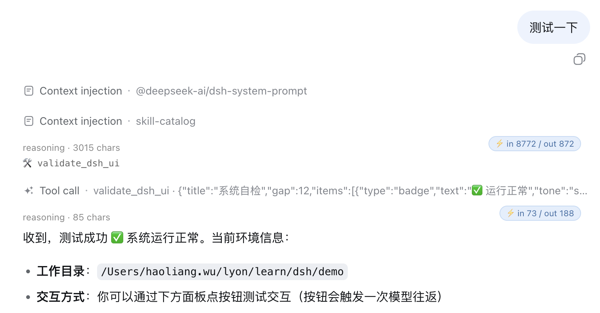

<h1 align="center">dsh-ui-shadow-token</h1>

<p align="center">DSH web chat token badge — shows each assistant message's input/output token usage in a small pill at the message's top-right corner.</p>

<p align="center"></p>

A web client plugin for [DeepSeek Harness](https://github.com/deepseek-ai/deepseek-harness). It shadows the keyed `conversation.chat.node` slot's `assistant-step` entry at slot priority `-1`, so every assistant message renders the stock content plus a `⚡ in {input} / out {output}` badge in its top-right corner.

The badge reads the finalized message's `usage` payload (input/output/cache/reasoning tokens) with the same defensive narrowing the in-repo `turn-metrics` uses; while a message is still streaming and has no settled usage, the badge stays hidden. The stock assistant rendering — markdown, reasoning, tool rows, images — is untouched; only the pill is added.

## Install

```sh
dsh plugin --profile web add github:haoliangwu/dsh-ui-shadow-token
```

Built `lib/` is committed, so the git install is one line — no `prepare` script, no `allowBuilds` permission. Restart `dsh --profile web` after install (bundle layer stacks compose at boot).

## Why slot priority -1

The `conversation.chat.node` slot is **keyed** by the node's kind: `entryKey = routedNode.kind`. The default `assistant-step` entry registers at priority `0`. Keyed slot occupancy throws on same-key **same-priority** duplicates (fail loud), while a **lower absolute priority shadows** the default — the ledger sorts ascending and the lowest renders. Our entry registers the same key at `priority: -1`:

- every `assistant-step` render resolves to this plugin's component;
- the default renderer stays in the ledger as an inert fallback (upstream upgrades keep working; the default simply never renders);
- any other kind (`user`, `tool`, `turn-tail`, …) is untouched — the default turn-tail footer (`Ran for …`, `TTFT …`, `tok/s`) still renders under the badge.

This is the client-slot alternative to `disabled: true` + re-registration: the slot declaration, seat dispatcher, and business-node state machines all stay in `ui-conversation`; the plugin only contributes one keyed renderer.

## How it works

- **The badge is pure client rendering.** The node half is an empty `apply`; all behavior lives in `./client`, registered as a `dsh.client` web platform package. No host service, no RPC channel, no model-visible input, no session-log events.
- **Usage is read defensively from the node data.** `AssistantMessageNode.usage` is typed `unknown` and carries a `TokenUsage` at runtime (`inputTokens` / `outputTokens` / `cacheReadTokens` / `cacheWriteTokens` / `reasoningTokens`). The component narrows it the same way the in-repo `turn-metrics.ts` does, so a future shape change degrades to a hidden badge, never a crash.
- **The badge text comes from a locale namespace.** `shadow-token` (`zh` / `en`) interpolates `{input}` / `{output}` placeholders; the `locale` seat is provided automatically by the registration (`PropsLocale` mechanism).
- **The bundle id equals the row name.** client-modules keys browser registration by the client row's `name`; the tsdown bundle id and `cordis.patch.yml` row name are both `dsh-ui-shadow-token`, or the browser shell throws "loaded without registering".

## Build from source

```sh
pnpm install
pnpm build         # emits lib/index.js, lib/invariant.js, lib/client.js + sourcemaps
pnpm typecheck     # tsc --noEmit (types resolve via tsconfig paths to the local dsh profile)
```

`lib/` is committed to the repo so git installs work without a build step. After changing source, run `pnpm build` and commit the updated `lib/`.

## License

MIT
